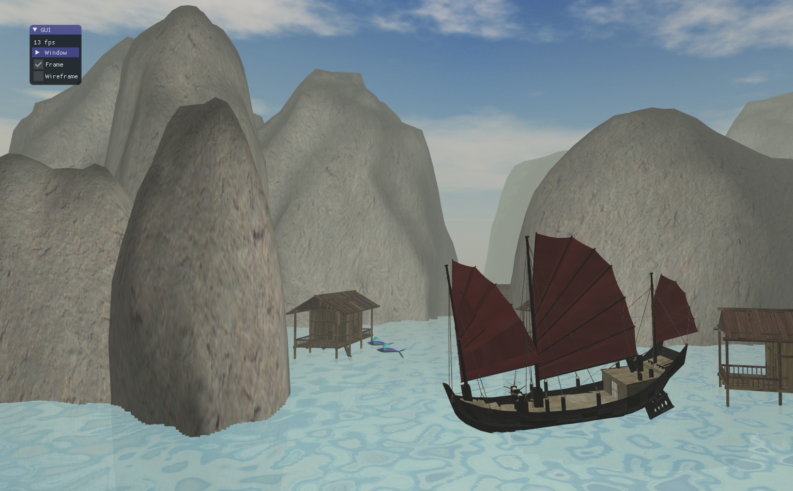

# ProjetINF443 - Ha Long Bay
This project, for Ecole Polytechnique's INF443 Computer Graphics class, was made my Adrien Goldszal and Emilie Liaud. It depicts a user-controlled boat moving around a 3D scene inspired by Ha Long Bay in Vietnam. 

  <figure style="margin: 10px; text-align: center;">
    
  </figure>
  <figure style="margin: 10px; text-align: center;">
    
  </figure>

Our scene and its comparison with the real Ha Long Bay.

### Short Video Playthrough

[https://youtu.be/HoY5HOhMbnk](https://youtu.be/HoY5HOhMbnk)

### Instructions for Windows users
1) Clone the repository locally
2) Compile (For example using windows_cmake_visual.bat in scenesinf443 > 03b_modeling > scripts)
3) Run (For example on Visual Studio)

### Objectifs
- [X] Déplacement problématique des rochers à chaque changement de mesh
- [X] Rochers choisis de manière aléatoire (pour l'instant rock2)
- [X] Problèmes de texture du fond marin
- [X] COLLISIONS --> Pas parfait
- [X] La lumière est actuellement fixée sur le bateau -> Ombres bizarres
- [X] Utiliser cette idée de lumière pour faire un cycle jour nuit : trop rouge le soir
- [X] Plus de choses sur l'eau :  maisons ?
- [ ] Bateau qui tangue trop
- [ ] Nuit plus foncée
- [ ] Herbe sur les rochers
- [ ] Déplaçage de la caméra quand on est dans le rocher
